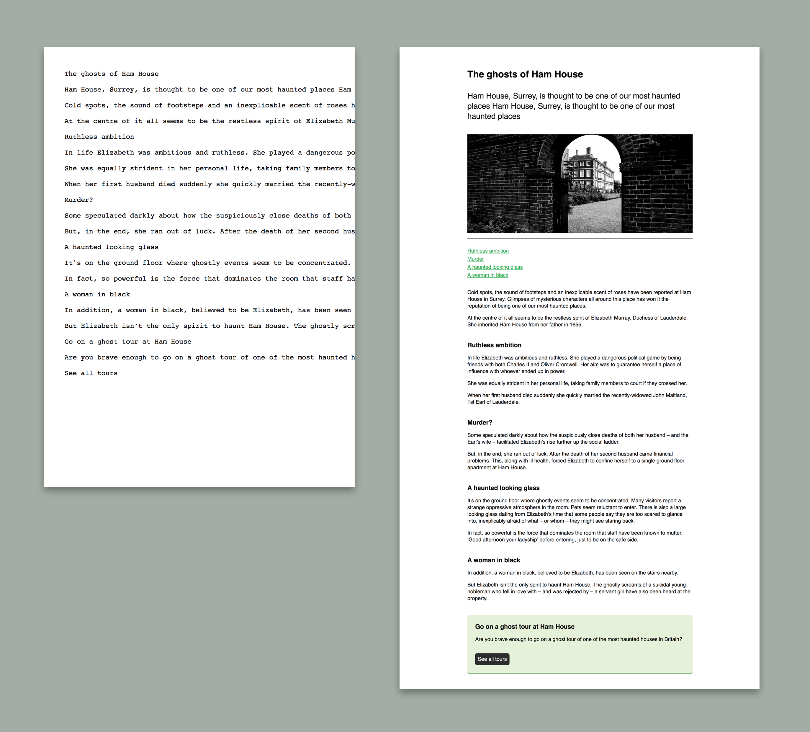

# Learn the basics of HTML and CSS

Here are the assets for an in-person introduction to HTML and CSS.

You will need:
- A text editor, for example [Atom](https://atom.io/)

Useful resources
- A [colour picker](https://www.google.com/search?hl=en-GB&authuser=0&rlz=1C5CHFA_enGB718GB718&ei=MCdGXPToN4H_8QXegozQDg&q=hex+colour+picker&oq=hex+colour+picker&gs_l=psy-ab.3..0i71l8.0.0..1764777...0.0..0.0.0.......0......gws-wiz.A8FvrAEquc0)
- A list of [CSS properties](http://www.stylinwithcss.com/resources_css_properties.php)
- [MDN HTML Docs](https://developer.mozilla.org/en-US/docs/Web/HTML)
- [MDN CSS Docs](https://developer.mozilla.org/en-US/docs/Web/CSS)

You will be changing an unstyled text file into a webpage using HTML tags and writing your own CSS

